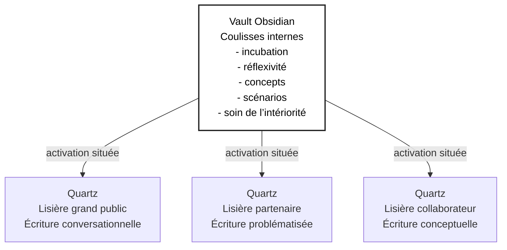

# 17-01-2026 — Où j’en suis (2)

## Mise en place d’un dispositif de tenue et de pilotage des écritures

### Continuité avec le jalon précédent

Ce document prolonge le premier jalon déposé le 15 janvier 2026.
Il ne marque pas un changement de cap, mais un **changement de profondeur** : là où le premier texte clarifiait l’intention et la posture, celui-ci explicite 
désormais les **conditions opératoires** permettant au projet *Conversations en lisières* de se développer sans se rigidifier ni se disperser.

---

## Ce qui s’est clarifié depuis

### 1. Le projet comme dispositif de conduite, non comme production de contenus

Les échanges récents m’ont permis de formuler plus nettement que ce projet ne vise pas d’abord la production de textes ou de plateformes, mais 
la **conduite dans le temps d’une capacité à penser ensemble**, y compris lorsque cette capacité est encore portée par un collectif très réduit.

Cela implique de prendre au sérieux :

* les rythmes,
* les seuils de visibilité,
* les effets de l’exposition,
* et les conditions humaines de soutenabilité du travail intellectuel.

---

### 2. Le vault Obsidian comme dispositif de tenue et de pilotage des écritures

J’ai désormais identifié le vault Obsidian non comme un simple espace de notes, mais comme un **dispositif de tenue et de pilotage des écritures**, au sens fort.

Il constitue à la fois :

* un espace de pilotage des différents régimes d’écriture,
* un lieu de régulation des stades de maturation des textes (germe, élaboration, stabilisation, publication),
* un dispositif de soin de l’intériorité citoyenne qui porte le projet.

Ce dispositif n’est pas pensé comme un centre de contrôle, mais comme une **architecture de tenue**, permettant de préserver les conditions nécessaires au 
travail de pensée, en évitant :

* la surexposition,
* la brutalisation du débat,
* la capture prématurée des idées par des cadres qui en réduiraient la portée.

> À propos du vault Obsidian (les coulisses) Le vault Obsidian est mon espace de travail interne.
> C’est là que je réfléchis, que j’écris des brouillons, que je laisse mûrir des idées et que je prends soin de ma capacité à penser.
> Tout ce qui s’y trouve n’a pas vocation à être rendu public.
> Les textes publiés dans les différents espaces de conversation viennent après ce travail de coulisses, lorsqu’ils sont suffisamment stabilisés pour être partagés.
---

### 3. L’intégration explicite des régimes de visibilité

Le projet distingue désormais explicitement plusieurs **régimes d’écriture et de visibilité**, qui ne sont ni hiérarchisés ni appelés à converger :

* un régime privé d’incubation et de réflexivité,
* des régimes conversationnels situés en lisière (grand public, partenaires, collaborateurs),
* des régimes plus conceptuels et théoriques,
* des régimes de publication stabilisée.

Ces régimes sont pensés comme **complémentaires mais non simultanés**, et leur activation relève d’un choix intentionnel, soutenu par le dispositif de tenue et 
de pilotage des écritures, et non d’un automatisme.

---

### 4. Une architecture multi-Quartz assumée

Dans cette logique, la publication n’est plus conçue comme un acte unique, mais comme l’**activation située** d’un texte dans une lisière donnée.

Concrètement :

* plusieurs sites Quartz, bâtis sur une architecture commune (forks d’un même socle), jouent le rôle de **lisières différenciées** :

  * lisière grand public,
  * lisière partenaire,
  * lisière collaborateur ;
* le vault reste l’unique espace de maturation des textes ;
* les Quartz constituent des **dispositifs de mise en visibilité**, articulés au dispositif de tenue interne, sans s’y substituer.

Cette séparation nette permet de préserver la cohérence du cheminement tout en rendant possible des formes de partage adaptées à des publics et des attentes 
hétérogènes.

---

### 5. Le collectif minimal comme point d’ancrage méthodologique

J’ai également clarifié la posture selon laquelle ce projet est porté, à ce stade, par un **collectif minimal**, hébergé dans un même self :

* un praticien réflexif, engagé dans l’action et l’expérience vécue ;
* un praticien-chercheur, engagé dans la mise à distance, la formalisation et l’écriture.

Chacune de ces positions comporte à la fois une part réalisatrice et une part bénéficiaire.
L’hétérogénéité des regards qui en résulte n’est pas un biais à corriger, mais une **condition de pertinence**, appelant la production d’objets médiateurs 
(schémas, fiches, dispositifs d’écriture).

Le dispositif de tenue et de pilotage des écritures joue ici un rôle central, en permettant à ces regards différenciés de coexister, de se confronter et 
de s’articuler sans se neutraliser.

---

## Ce qui est désormais posé (sans être figé)

À ce stade du projet, les éléments suivants sont considérés comme stabilisés **pour maintenant** :

* le rôle central du vault comme **infrastructure épistémique de tenue** ;
* la distinction claire entre maturation interne et publication située ;
* le choix d’une architecture multi-Quartz isomorphe ;
* l’inscription explicite d’une éthique du soin et de la furtivité (au sens de la charte du *Verstohlen*) dans la conduite du projet.

Ces éléments constituent un **cadre de travail**, soutenu par le dispositif de tenue et de pilotage des écritures, non un modèle définitif.

---

## Ce qui reste volontairement ouvert

Restent ouverts, et assumés comme tels :

* les critères précis de passage d’un régime d’écriture à un autre ;
* la manière dont des tiers pourront, à terme, entrer dans ce dispositif sans en fragiliser l’équilibre ;
* le statut futur de certains textes (conversationnels aujourd’hui, peut-être conceptuels demain) ;
* la façon dont ce cheminement sera ultérieurement mobilisé comme matériau réflexif dans un cadre doctoral formel ou non.

Ces zones ouvertes ne sont pas des angles morts, mais des **espaces de vigilance**, explicitement pris en charge par l’architecture de tenue mise en place.

---

## Prochain pas possible 

À partir de ce jalon, plusieurs pas sont envisageables, sans qu’aucun ne s’impose :

* formaliser une **charte interne du dispositif de tenue et de pilotage des écritures** ;
* documenter plus finement les **régimes d’écriture** comme objets théoriques ;
* esquisser une première fiche conceptuelle sur l’**évaluation comme conduite du collectif pensant** ;
* ou simplement laisser ce cadre agir, avant toute nouvelle production.

---

*Ce deuxième jalon ne vise pas à accélérer le projet, mais à lui donner une tenue suffisante pour durer.
Il pourra être amendé, déplacé ou contredit par les jalons suivants.*    
     

